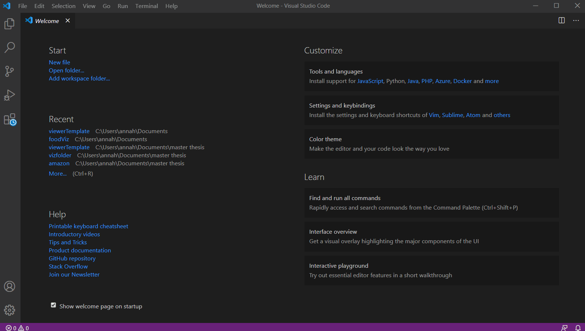
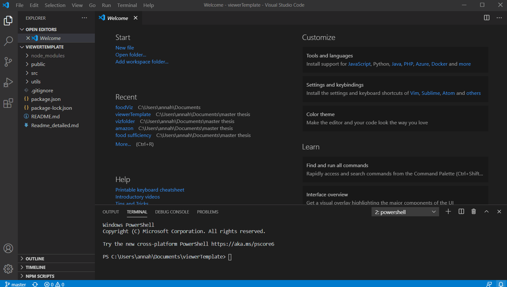
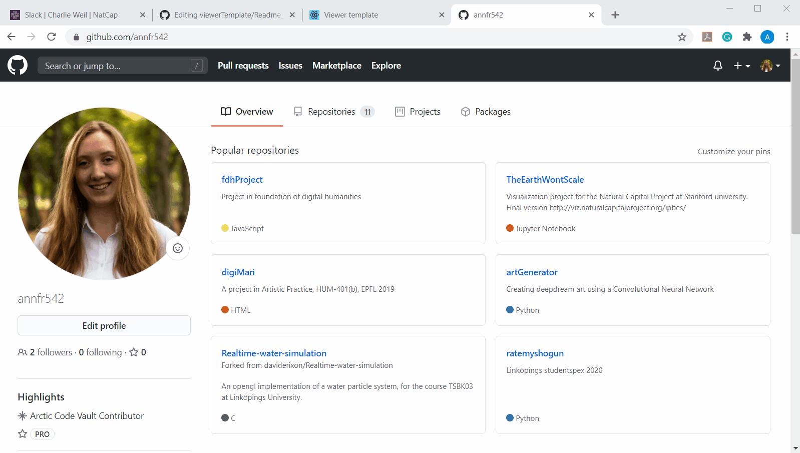
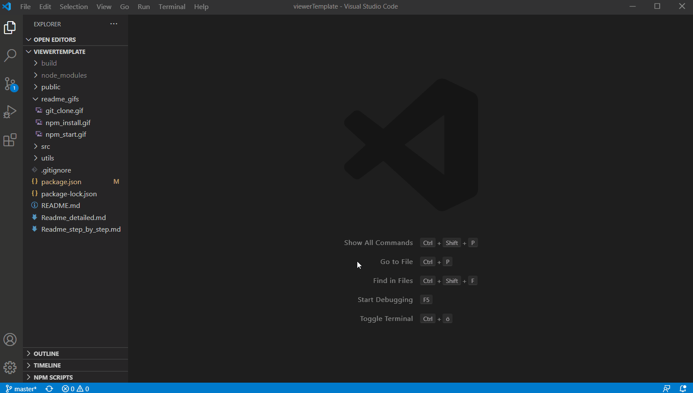
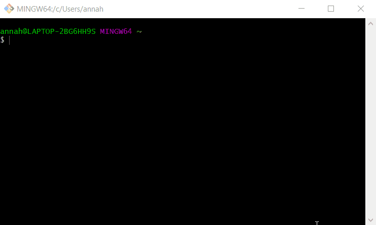
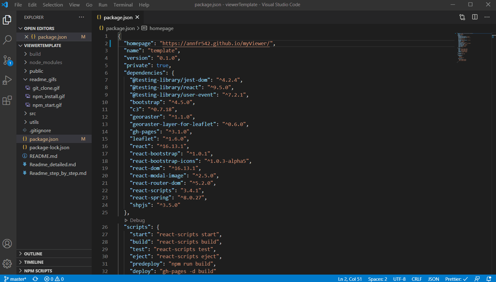

Demo: http://viz.naturalcapitalproject.org/viewerTemplate/

This is a template for creating your own map-based dashboard <br/>

You will find here detailed information to use the viewerTemplate.

# Set up

1. Install [node.js](https://nodejs.org/en/download/), and a text editor (e.g  [VScode](https://code.visualstudio.com/download) )
2. Download or clone this repository and open the project directory in your text editor


3. Open the terminal in your project directory and run `npm install` - this will install all dependencies


4. Run `npm start` -- this will run the app in the development mode.<br />
   Open [http://localhost:3000](http://localhost:3000) to view it in the browser.
   The page will reload if you make edits.<br />
   You will also see any errors in the console. <br />
   *The browser might open http://localhost:3000/viewerTemplate by default, the "viewerTemplate" part of the link will be removed once you follow the steps in "Deploying the dashboard to GitHub pages"*
   


# Deploy viewer online 
[Detailed workflow with images](Readme_step_by_step.md#Deploy-viewer-online)
1. On github, create a new Github repository (you need to have a GitHub account). We'll deploy the viewer with GitHub pages.


2. In the `package.json` file, change the `homepage` property to `http://{username}.github.io/{repository-name}/`. (e.g `"homepage": "http://myusername.github.io/myViewer/"`)


3. In command line (Open your terminal/git bash and navigate to your project folder), initialize your repo and link it: <br/>
   Open your terminal/git bash and navigate to your project folder<br/>
   ```
   git remote set-url origin https://github.com/{username}/{repo-name}.git
   ```
   
   
4. Deploy your app, run: `npm run deploy` <br/>
 
   Yay!! Your app is now running at `https://{username}.github.io/{repo-name}/`
   -----> to update any changes `npm run deploy`
5. (Optional) Push the source code to your Github repo:
```
git add *
git commit -m "Your commit message"
git push origin master
```
